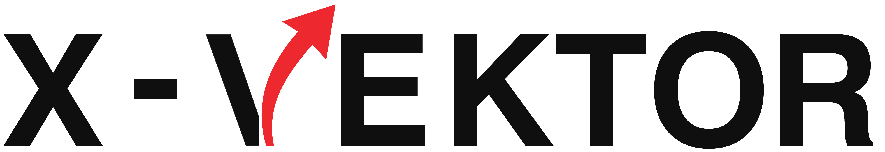

# X-Vector - Jogo Educativo de Vetores



X-Vector é um jogo educativo desenvolvido em Python com PyGame que ensina conceitos de vetores de forma interativa e divertida. O jogo oferece dois modos de dificuldade com desafios progressivos para estudantes de física e matemática.

## 🎯 Objetivo

O objetivo do X-Vector é ajudar os jogadores a compreender e praticar:
- Representação gráfica de vetores
- Componentes vetoriais (módulo, direção e sentido)
- Operações com vetores (soma, subtração e multiplicação por escalar)
- Sistema de coordenadas em grade

## ✨ Características

- **Dois modos de jogo**: Básico e Avançado
- **Interface intuitiva** com sistema de coordenadas alfanumérico
- **Feedback visual imediato** para respostas corretas/incorretas
- **Sistema de progressão** com múltiplos níveis de dificuldade
- **Design responsivo** com elementos visuais atrativos
- **Sons de feedback** para melhor experiência do usuário

## 🎮 Modos de Jogo

### Modo Básico (Nível 1)
- Introdução aos conceitos fundamentais de vetores
- Foco em identificar módulo, origem e extremidade
- 12 questões progressivas

### Modo Avançado (Nível 2)
- Operações vetoriais complexas (soma, subtração, combinações lineares)
- Aplicação da regra do paralelogramo
- 10 desafios com diferentes operações

## 🛠️ Tecnologias Utilizadas

- **Python 3.x** - Linguagem de programação
- **PyGame** - Biblioteca para desenvolvimento de jogos
- **JSON** - Armazenamento das questões e configurações

## 📦 Instalação

### Pré-requisitos
- Python 3.6 ou superior
- Pip (gerenciador de pacotes do Python)

### Passos para instalação

1. Clone o repositório:
```bash
git clone https://github.com/seu-usuario/x-vector.git
cd x-vector
```

2. Instale as dependências:
```bash
pip install pygame
```

3. Execute o jogo:
```bash
python main.py
```

## 🎯 Como Jogar

1. Selecione o modo de jogo (Básico ou Avançado)
2. Leia atentamente a questão apresentada
3. Use o mouse para selecionar:
   - Ponto de origem (clique verde)
   - Ponto de extremidade (clique vermelho)
4. Confirme sua resposta e receba feedback imediato
5. Avance para a próxima questão após acertar

### Controles
- **Mouse**: Selecionar pontos na grade
- **R**: Limpar seleção atual
- **Enter/Escpaço**: Confirmar resposta ou avançar
- **ESC**: Voltar ao menu principal

## 📁 Estrutura do Projeto

```
x-vector/
├── main.py          # Ponto de entrada do jogo
├── game.py          # Lógica principal do jogo
├── board.py         # Implementação do tabuleiro/tela
├── vector.py        # Classe Vector para representação
├── questions.json   # Questões do modo básico
├── questions_hard.json # Questões do modo avançado
├── assets/          # Arquivos de mídia
│   ├── logo_uema.png
│   ├── logo_xvector.png
│   ├── logo_uemanet.png
│   ├── correct.wav
│   ├── wrong.wav
│   └── background.png
└── README.md
```

## 🎓 Aplicações Educativas

X-Vector é ideal para:
- Aulas de física do ensino médio
- Cursos introdutórios de matemática vetorial
- Reforço de conceitos vetoriais
- Preparação para vestibulares e ENEM

## 🔧 Personalização

Professores podem personalizar o jogo editando os arquivos JSON de questões:

- `questions.json`: Para o modo básico
- `questions_hard.json`: Para o modo avançado

Cada questão segue um formato específico com campos para:
- Nível de dificuldade
- Operação vetorial (no modo avançado)
- Módulo, origem e extremidade
- Posições corretas na grade

## 📝 Licença

Este projeto é desenvolvido para fins educativos e está sob a licença MIT.

## 👥 Desenvolvimento

X-Vector foi desenvolvido como parte de um projeto educacional da UEMA (Universidade Estadual do Maranhão) em parceria com a UEMANet.

## 🤝 Contribuições

Contribuições são bem-vindas! Para contribuir:

1. Faça um fork do projeto
2. Crie uma branch para sua feature (`git checkout -b feature/AmazingFeature`)
3. Commit suas mudanças (`git commit -m 'Add some AmazingFeature'`)
4. Push para a branch (`git push origin feature/AmazingFeature`)
5. Abra um Pull Request

---

**Divirta-se aprendendo sobre vetores com X-Vector!** 🚀
